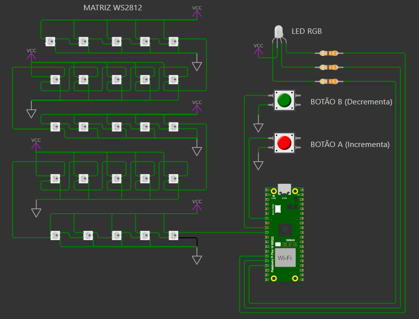

# Interrupções com Raspberry Pi Pico W

## Descrição
Este projeto implementa um sistema de controle interativo utilizando o Raspberry Pi Pico. O código manipula uma matriz 5x5 de LEDs WS2812 para exibir números de 0 a 9. O sistema responde a interrupções geradas por dois botões, incrementando ou decrementando o número exibido na matriz. Além disso, um LED vermelho pisca a 5 Hz continuamente, sem bloquear a execução do programa.

## Esquema do Projeto

    

## Demonstração em Vídeo

Você pode assistir a uma demonstração do funcionamento deste projeto no seguinte vídeo:

[Assistir à Demonstração](https://www.youtube.com/watch?v=2OAxGTcpw3o)

## Funcionalidades
- **Exibição de números de 0 a 9**: Os números são exibidos na matriz 5x5 de LEDs WS2812, com cada número sendo representado por um padrão de LEDs acesos ou apagados.
- **Interrupções por botões**: O sistema utiliza interrupções de dois botões para incrementar ou decrementar o número exibido. O debounce é tratado via software para evitar múltiplas leituras.
- **Piscar LED vermelho**: O LED vermelho pisca a 5 Hz (100 ms de intervalo) independentemente da interação do usuário com os botões.
  
## Materiais Utilizados
- 1 Raspberry Pi Pico
- 1 Matriz 5x5 de LEDs WS2812
- 2 Botões de pressão
- 1 LED RGB (vermelho, verde e azul)
- 1 Resistor de 330 ohms

## Requisitos
- Raspberry Pi Pico configurado para programação com a SDK C.
- Biblioteca `pico/stdlib.h` para controle do hardware.
- Biblioteca `hardware/irq.h` para manejo de interrupções.
- Biblioteca `hardware/pio.h` para controle da matriz de LEDs WS2812.

## Pinagem
- **Botão A**: GPIO 5
- **Botão B**: GPIO 6
- **LED Vermelho**: GPIO 13
- **LED Verde**: GPIO 12
- **LED Azul**: GPIO 11
- **Pino de controle da matriz WS2812**: GPIO 7

## Diagrama de Funcionamento

### Como Funciona
- A matriz de LEDs exibe os números de 0 a 9, com base na seleção do número atual armazenado na variável `numero_atual`.
- A cada pressionamento de botão (A ou B), o número exibido na matriz é incrementado ou decrementado, respectivamente.
- O LED vermelho pisca continuamente a 5 Hz sem interferir na execução do restante do programa.
- O sistema utiliza interrupções para detectar a pressão dos botões e atualizar o número exibido na matriz.

### Funções Principais
- **`botoes_irq_handler()`**: Função de interrupção que lida com a detecção do pressionamento dos botões. Incrementa ou decrementa o número exibido.
- **`matriz_numeros[][][]`**: Array que armazena os padrões de LEDs para os números de 0 a 9.
- **`number_animation()`**: Função que desenha o número na matriz de LEDs usando

o protocolo de comunicação WS2812.
- **`desenho_pio()`**: Desenha um número específico na matriz 5x5 de LEDs, enviando os valores RGB correspondentes.
- **`matrix_rgb()`**: Converte os valores RGB para o formato esperado pela matriz WS2812.

## Estrutura de Arquivos
- **main.c**: Código principal do programa, incluindo a configuração dos pinos, interrupções, controle da matriz de LEDs e controle do LED vermelho.
- **pio_matrix.pio.h**: Arquivo PIO que contém o código necessário para controlar a matriz WS2812.

## Como Usar
1. **Conectar os Componentes**: Conecte a matriz WS2812, os botões e o LED RGB ao Raspberry Pi Pico de acordo com os pinos especificados.
2. **Compilar o Código**: Utilize a SDK C do Raspberry Pi para compilar o código.
3. **Carregar o Programa no Raspberry Pi Pico**: Transfira o código compilado para o Raspberry Pi Pico e execute-o.
4. **Interagir com o Sistema**: Pressione os botões A e B para incrementar ou decrementar os números exibidos na matriz de LEDs.

## Como Testar
- **Teste de Botões**: Pressione os botões A e B para ver a alteração do número exibido na matriz 5x5.
- **Teste do LED Vermelho**: Observe o LED vermelho piscando a 5 Hz durante a execução do programa.

## Contato
Caso tenha dúvidas ou sugestões, entre em contato:
- **Desenvolvedor**: Leonardo Rodrigues
- **Linkedin**: https://www.linkedin.com/in/leonardorodrigues7/